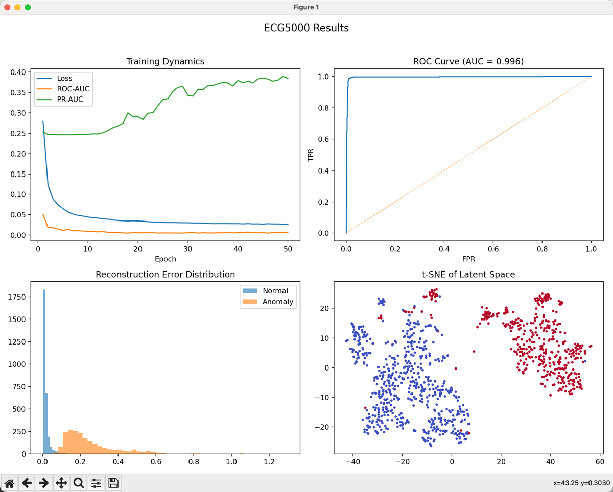

# 基于最优传输算法的异常检测网络训练


## 📒项目结构

```
project/
    ├── data/                           # 数据集（需自行下载）
    │     ├── cable/
    │     ├── cifar-10/
    │     ├── ECG5000/
    │     ├── hypothyroid.csv
    ├── backup/
    │     ├── cnn_autoencoder.py        # 备用cnn神经网络
    │     ├── cnn_encoder.py
    ├── models/                         # 两种神经网络
    │     ├── __init__.py
    │     ├── cnn_autoencoder.py
    │     ├── cnn_encoder.py
    │     ├── mlp_autoencoder.py
    │     ├── mlp_encoder.py
    ├── config.py                       #参数存放
    ├── data.py                         #loader
    ├── evaluate.py                     #计算
    ├── main.py                         #主程序👏
    ├── sinkhorn.py                     #sinkhorn算法
    ├── train.py                        #训练模型
    ├── requirements.txt                #依赖库安装
```

## 👐简介

本项目是基于`最优传输理论`的异常检测神经网络训练模型，主要思想为`从点到分布`的最优传输距离与`sinkhorn`算法实现新的异常检测策略，以提高异常检测的稳定性。


## 数据集来源-Data Resource

本项目数据下载均来自公开数据集平台`www.kaggle.com`，`data/`中可以看到本项目使用了四组不同的数据集，分别对应`MVTec-AD`、`CIFAR-10`、`ECG5000`、`Thyroid Dataset`。

如果你想单独查看各个数据集的结构与简介，以下是分别的传送门（各地址并非数据库源地址，仅为方便查看与下载）：

🚀`MVTec-AD`：https://www.kaggle.com/datasets/ipythonx/mvtec-ad

🚀`CIFAR-10`：https://www.kaggle.com/datasets/pankrzysiu/cifar10-python

🚀`ECG5000`：https://www.kaggle.com/datasets/salsabilahmid/ecg50000

🚀`Thyroid Dataset`：https://www.kaggle.com/datasets/yasserhessein/thyroid-disease-data-set


## 快速上手-Quick Start
将github项目完整拷贝到本地（注意：如果要手动下载数据库，本项目仅使用MVTec-AD目录下的子目录cable/用作训练，各位也可以尝试使用别的子目录进行鲁棒性测试）。

```bash
git clone https://github.com/StealthyMurloc/OTAD.git
cd OTAD
```

安装依赖

```bash
pip install -r requirements.txt
```

在`config.py`中可设置训练不同神经网络的参数，切换训练数据库功能需调整`ENVIRONMENT`参数，详见当行注释。在`main.py`中运行进行训练。

训练结束后，会得到由四张表格构成的图，分别展示`Training Dynamics`、`ROC(AUC)`、`Reconstruction Error`、`Latent t-SNE`，如图例所示。



## 注意事项

项目中`backup`目录下的cnn代码用于训练`cifar10`图像（32 32大小）；`models`目录下的cnn代码用于训练`MVTec-AD`图像（256 256大小）。请注意替换避免无效训练。

若运行效率过低或训练负载过高，可合理调整参数以正常运行。

## 数据库来源与致谢
### ECG5000 数据集
ECG5000 数据集源自PhysioNet的BIDMC Congestive Heart Failure Database（记录编号：chf07）。该数据库包含来自15位患有严重充血性心力衰竭患者的长时间心电图记录。

引用文献：Goldberger, A. L., Amaral, L. A. N., Glass, L., Hausdorff, J. M., Ivanov, P. C., Mark, R. G., Mietus, J. E., Moody, G. B., Peng, C.-K., & Stanley, H. E. (2000). PhysioBank, PhysioToolkit, and PhysioNet: Components of a New Research Resource for Complex Physiologic Signals. Circulation, 101(23), e215–e220.

数据集链接：https://physionet.org/content/chfdb/1.0.0/

### Thyroid Disease 数据集
Thyroid Disease数据集由Ross Quinlan提供，包含多个与甲状腺疾病相关的数据库，广泛用于机器学习研究。

引用文献：Quinlan, R. (1986). Thyroid Disease [Dataset]. UCI Machine Learning Repository. https://doi.org/10.24432/C5D010

许可协议：该数据集遵循 Creative Commons Attribution 4.0 International (CC BY 4.0) 许可协议。

数据集链接：https://archive.ics.uci.edu/ml/datasets/thyroid+disease

### CIFAR-10 数据集
CIFAR-10数据集由Alex Krizhevsky、Vinod Nair和Geoffrey Hinton创建，包含10个类别的60,000张32x32彩色图像，是计算机视觉领域的标准数据集。

引用文献：Krizhevsky, A. (2009). Learning Multiple Layers of Features from Tiny Images. Technical Report, University of Toronto.

数据集链接：https://www.cs.toronto.edu/~kriz/cifar.html

### MVTec AD 数据集
MVTec Anomaly Detection (MVTec AD) 数据集是一个用于无监督异常检测的真实世界工业图像数据集，包含5,354张高分辨率彩色图像，涵盖15个不同的对象和纹理类别。每个类别包括无缺陷的训练图像和包含各种缺陷的测试图像，缺陷类型包括划痕、凹痕、污染和结构变化等，共计73种不同类型的缺陷。此外，数据集还提供了所有异常的像素级精确标注。

引用文献：Paul Bergmann, Kilian Batzner, Michael Fauser, David Sattlegger, Carsten Steger. "The MVTec Anomaly Detection Dataset: A Comprehensive Real-World Dataset for Unsupervised Anomaly Detection." International Journal of Computer Vision, 129(4):1038–1059, 2021. DOI: 10.1007/s11263-020-01400-4

许可协议：该数据集遵循Creative Commons Attribution-NonCommercial-ShareAlike 4.0 International License (CC BY-NC-SA 4.0)。特别地，禁止将该数据集用于商业目的。如您不确定您的应用是否违反了该许可协议的非商业使用条款，请联系MVTec。

数据集链接：https://www.mvtec.com/company/research/datasets/mvtec-ad

## ☝️🤓注：

本项目为本科毕业论文《基于最优传输理论的深度异常检测》的配套实现，包含论文中提出的模型结构、最优传输异常度量方法以及全部实验流程。

- 作者：王嘉骆  
- 所在院系：华东理工大学 数学学院 信息与计算科学系  
- 指导教师：黄文亮
- 提交时间：2025年5月  

本项目对应论文正文第4、5章，核心贡献在于构建潜在空间中基于熵正则Wasserstein距离的异常检测机制，并在多种数据集上验证其性能与鲁棒性。

> 本项目为本人在本科阶段独立完成，保留署名权利。项目仅供教学与学术用途，禁止商用或未署名转载。

> 本项目仅用于学术研究用途，若侵犯任何人的权益，请联系修改或删除。

> 本项目中使用的所有数据集均来自公开平台，仅用于学术研究目的。若有任何版权争议，请联系修改或删除。

> 项目所涉及数据集中的任何图像、标签或内容均归原数据集提供者所有，相关内容的真实性、准确性和合法性不代表本人的观点或立场。

> 若原始数据内容引发争议、歧义或侵犯权益，请以原数据发布方的说明为准，或联系原作者处理。本项目作者不对数据集本身内容及使用过程中的任何直接或间接后果承担责任。
